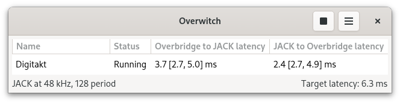

# Overwitch

[//]: # (Do not modify this file manually.)
[//]: # (This file is generated from the docs directory by executing `make`.)

Overwitch is a set of JACK (JACK Audio Connection Kit) clients for Overbridge 2 devices. Since PipeWire is ABI compatible with JACK, Overwitch works with PipeWire too.



This project is based on the Overbridge USB reverse engineering done by Stefan Rehm in [dtdump](https://github.com/droelfdroelf/dtdump).

The papers [Controlling adaptive resampling](https://kokkinizita.linuxaudio.org/papers/adapt-resamp.pdf) and [Using a DLL to filter time](https://kokkinizita.linuxaudio.org/papers/usingdll.pdf) by Fons Adriaensen have been very helpful and inspiring, as well as his own implementation done in the zita resamplers found in the [alsa tools](https://github.com/jackaudio/tools) project.

At the moment, it provides support for all Overbridge 2 devices, which are Analog Four MKII, Analog Rytm MKII, Digitakt, Digitakt II, Digitone, Digitone II, Digitone Keys, Analog Heat, Analog Heat MKII, Analog Heat +FX and Syntakt.

Overbridge 1 devices, which are Analog Four MKI, Analog Keys and Analog Rytm MKI, are not supported yet.

Overwitch consists of 5 different binaries divided in 2 categories: multi-device applications (they can **not** be used simultaneously) and single-device utilities.

Multi-device applications:

* `overwitch`, which is a GUI application that uses the below D-Bus service under the hood.
* `overwitch-service`, which is a D-Bus and CLI application that will create a JACK client for every device detected or plugged in later.

Single-device utilities:

* `overwitch-cli`, which is a single-device JACK client program.
* `overwitch-play`, which plays multitrack audio thru Overbridge devices.
* `overwitch-record`, which records multitrack audio from Overbridge devices.

For a device manager application for Elektron devices, check [Elektroid](https://dagargo.github.io/elektroid/).

## Installation

As with other autotools project, you need to run the commands below. There is a compilation option available.

* If you just want to compile the command line applications, pass `CLI_ONLY=yes` to `./configure`.

```
autoreconf --install
./configure
make
sudo make install
sudo ldconfig
```

Some udev rules might need to be installed manually with `sudo make install` from the `udev` directory as they are not part of the `install` target. This is not needed when packaging or when distributions already provide them.

The package dependencies for Debian based distributions are:
- automake
- libtool
- libusb-1.0-0-dev
- libjack-jackd2-dev
- libsamplerate0-dev
- libsndfile1-dev
- autopoint
- gettext
- libsystemd-dev
- libjson-glib-dev
- libgtk-4-dev (only if `CLI_ONLY=yes` is not used)
- systemd-dev (only used to install the udev rules)

You can easily install all them by running this.

```
sudo apt install automake libtool libusb-1.0-0-dev libjack-jackd2-dev libsamplerate0-dev libsndfile1-dev autopoint gettext libsystemd-dev libjson-glib-dev libgtk-4-dev systemd-dev
```

For Fedora, run this to install the build dependencies.

```
sudo yum install automake libtool libusb1-devel jack-audio-connection-kit-devel libsamplerate-devel libsndfile-devel gettext-devel json-glib-devel gtk4-devel systemd-devel
```

For Arch, no additional dependencies are needed.

As this will install `jackd2`, you would be asked to configure it to be run with real time priority. Be sure to answer yes. With this, the `audio` group would be able to run processes with real time priority. Be sure to be in the `audio` group too.

### systemd service

For embedded systems or users not wanting to use the GUI, it is recommended to install the systemd service unit by running `sudo make install` from the `systemd` directory. Notice `overwitch.service` is installed as a user service.

As with any other systemd services, it needs to be started with `systemctl start overwitch --user`. Commands `stop` and `restart` are also available.

To allow the service to be started at boot, running `systemctl --user enable overwitch.service` is needed.

## Usage

Overwitch contains two JACK clients. One is a D-Bus and systemd compatible hotplug service what will manage all the connected devices, which is used by the GUI application; and the other is a single client CLI application. Additionally, a playing and recording utilities for the CLI are also included.

Regarding the JACK clients, latency needs to be under control and it can be tuned with the following parameters.

- Quality, which controls the resampler accuracy. The higher the quality, the higher CPU usage. A medium value is recommended. Notice that a value of 0 means the highest quality while a value of 4 means the lowest.
- Blocks, which controls the amount of data sent in a single USB operation. The more blocks, the higher latency but the lower CPU usage. As too lower values might stress the machines to the point of requiring a reboot, 10 is the minimum recommended value. If a device become unresponsive or you see the error below, increase the blocks and restart the device.

```
ERROR:engine.c:351:cb_xfr_audio_out: h2o: Error on USB audio transfer (0 B): LIBUSB_TRANSFER_TIMED_OUT
```

### Use cases

For all use cases, the default installation is needed.

#### Typical desktop user

Just use `overwitch` (GUI). This will start up the included D-Bus service when needed. No other tools are required.
Notice that closing the application window does **not** terminate the D-Bus service, which means that the hotplug system is still running. Starting the application again will show the window with the ongoing state of all the devices. To terminate everything, click on the exit menu.

#### Non GUI user

Install the systemd service from the `systemd` directory and start it up. This uses the same executable as the D-Bus service and will start a JACK client for any devices as soon as it is connected. No other tools are required. Stopping the service will stop all the devices.

#### Testing

In case of testing Overwitch, only the CLI utilities should be used. In this scenario, use all of these with `-vv` to add some debugging output.

### overwitch

The GUI is self explanatory and does not requiere any parameter passed from the command line. It controls the D-Bus service, which will manage any Overbridge device.

Notice that changing the preferences will restart all the clients.

It is possible to rename Overbridge devices by simply editing its name on the list. Still, as JACK devices can not be renamed while running, the clients will be restarted.

### overwitch-service

Using `overwitch-service` allows having a systemd unit which uses device hotplug. This will load the configuration from the same configuration file the GUI uses.

This is a configuration example with the recommended properties. Not all the properties are shown here.

```
$ cat ~/.config/overwitch/preferences.json
{
  "blocks" : 12,
  "timeout" : 10,
  "quality" : 2,
  "pipewireProps" : "{ node.group = \"pro-audio-0\" }"
}
```

Obviously, when running the service there is no need for the GUI whatsoever.

Notice that this binary is used by both the D-Bus service and the systemd service is rarely needed to be run like this.

### overwitch-cli

The CLI interface allows the user to create a single JACK client and have full control the options to be used.

First, list the available devices. The first element is an internal ID that allows to identify the devices.

```
$ overwitch-cli -l
0: Digitakt (ID 1935:0b2c) at bus 003, address 021
```

Then, you can choose which device you want to use by using `-n`.

```
$ overwitch-cli -n 0
```

You can select the device by name too but the use of this option is discouraged and `-n` should be used instead. When using this option, the first device in the list will be used.

```
$ overwitch-cli -d Digitakt
```

To stop, just press `Ctrl+C`. You'll see an oputput like the one below. Notice that we are using the verbose option here but it is **not recommended** to use it and it is showed here for illustrative purposes only.

```
$ overwitch-cli -n 0 -vv -b 12
DEBUG:overwitch.c:308:ow_get_device_desc_file: Searching device in /home/user/.config/overwitch/devices.json
DEBUG:overwitch.c:314:ow_get_device_desc_file: Failed to open file “/home/user/.config/overwitch/devices.json”: No such file or directory
DEBUG:overwitch.c:308:ow_get_device_desc_file: Searching device in /usr/local/share/overwitch/devices.json
DEBUG:overwitch.c:161:ow_get_device_desc_reader: Device with PID 2860 found
DEBUG:overwitch.c:90:ow_get_device_list: Found Digitakt (bus 003, address 018, ID 1935:0b2c)
DEBUG:engine.c:550:ow_engine_init: USB transfer timeout: 10
DEBUG:engine.c:432:ow_engine_init_mem: Blocks per transfer: 12
DEBUG:engine.c:446:ow_engine_init_mem: o2h: USB in frame size: 48 B
DEBUG:engine.c:447:ow_engine_init_mem: h2o: USB out frame size: 8 B
DEBUG:engine.c:475:ow_engine_init_mem: o2h: USB in block size: 368 B
DEBUG:engine.c:477:ow_engine_init_mem: h2o: USB out block size: 88 B
DEBUG:engine.c:485:ow_engine_init_mem: o2h: audio transfer size: 4032 B
DEBUG:engine.c:487:ow_engine_init_mem: h2o: audio transfer size: 672 B
DEBUG:engine.c:1085:ow_engine_load_overbridge_name: USB control in data (32 B): Digitakt
DEBUG:engine.c:1105:ow_engine_load_overbridge_name: USB control in data (16 B): 0097       1.52A
DEBUG:dll.c:153:ow_dll_host_init: Initializing host side of DLL...
DEBUG:jclient.c:568:jclient_start: Starting thread...
DEBUG:jclient.c:175:jclient_set_sample_rate_cb: JACK sample rate: 48000
DEBUG:jclient.c:446:jclient_run: Using RT priority 77...
DEBUG:jclient.c:448:jclient_run: Registering ports...
DEBUG:jclient.c:453:jclient_run: Registering output port Main L...
[...]
DEBUG:jclient.c:472:jclient_run: Registering input port Main R Input...
DEBUG:resampler.c:594:ow_resampler_init_samplerate: Setting resampler sample rate to 48000
DEBUG:resampler.c:585:ow_resampler_init_buffer_size: Setting resampler buffer size to 128
DEBUG:resampler.c:175:ow_resampler_reset_buffers: Resetting buffers...
DEBUG:resampler.c:157:ow_resampler_clear_buffers: Clearing buffers...
DEBUG:dll.c:164:ow_dll_host_reset: Resetting the DLL...
DEBUG:engine.c:944:ow_engine_start: Starting thread...
DEBUG:dll.c:53:ow_dll_overbridge_init: Initializing Overbridge side of DLL (48000.0 Hz, 84 frames)...
DEBUG:jclient.c:518:jclient_run: Activating...
DEBUG:jclient.c:166:jclient_set_buffer_size_cb: JACK buffer size: 128
DEBUG:jclient.c:527:jclient_run: Activated
DEBUG:resampler.c:421:ow_resampler_compute_ratios: Digitakt @ 003,018 (Digitakt): Setting Overbridge side to steady (notifying readiness)...
DEBUG:engine.c:776:run_audio: Notification of readiness received from resampler
DEBUG:engine.c:798:run_audio: Booting or clearing engine...
DEBUG:resampler.c:450:ow_resampler_compute_ratios: Digitakt @ 003,018 (Digitakt): Booting resampler...
Digitakt @ 003,018 (Digitakt): o2h latency: -1.0 [-1.0, -1.0] ms; h2o latency: -1.0 [-1.0, -1.0] ms, o2h ratio: 1.000000
DEBUG:resampler.c:473:ow_resampler_compute_ratios: Digitakt @ 003,018 (Digitakt): Tuning resampler...
Digitakt @ 003,018 (Digitakt): o2h latency: -1.0 [-1.0, -1.0] ms; h2o latency: -1.0 [-1.0, -1.0] ms, o2h ratio: 1.000082
Digitakt @ 003,018 (Digitakt): o2h latency: -1.0 [-1.0, -1.0] ms; h2o latency: -1.0 [-1.0, -1.0] ms, o2h ratio: 1.000057
DEBUG:resampler.c:492:ow_resampler_compute_ratios: Digitakt @ 003,018 (Digitakt): Running resampler...
DEBUG:jclient.c:74:jclient_set_latency_cb: JACK latency request
DEBUG:jclient.c:92:jclient_set_latency_cb: h2o latency: [ 128, 128 ]
DEBUG:jclient.c:74:jclient_set_latency_cb: JACK latency request
DEBUG:jclient.c:78:jclient_set_latency_cb: o2h latency: [ 128, 128 ]
DEBUG:resampler.c:313:resampler_o2h_reader: o2h: Emptying buffer (6144 B) and running...
DEBUG:resampler.c:296:resampler_o2h_reader: o2h: Audio ring buffer underflow (0 < 4032)
[...]
DEBUG:resampler.c:296:resampler_o2h_reader: o2h: Audio ring buffer underflow (0 < 4032)
Digitakt @ 003,018 (Digitakt): o2h latency:  4.2 [ 2.7,  4.4] ms; h2o latency: -1.0 [-1.0, -1.0] ms, o2h ratio: 1.000056
[...]
Digitakt @ 003,018 (Digitakt): o2h latency:  3.0 [ 2.7,  4.6] ms; h2o latency: -1.0 [-1.0, -1.0] ms, o2h ratio: 1.000018
^C
DEBUG:jclient.c:293:jclient_stop: Stopping client...
DEBUG:resampler.c:641:ow_resampler_stop: Stopping resampler...
DEBUG:engine.c:1069:ow_engine_stop: Stopping engine...
DEBUG:engine.c:860:run_audio: Processing remaining events...
Digitakt @ 003,018 (Digitakt): o2h latency: -1.0 [-1.0, -1.0] ms; h2o latency: -1.0 [-1.0, -1.0] ms, o2h ratio: 1.000014
DEBUG:jclient.c:532:jclient_run: Exiting...
DEBUG:jclient.c:158:jclient_jack_client_registration_cb: JACK client Digitakt is being unregistered...
```

You can list all the available options with `-h`.

```
$ overwitch-cli -h
overwitch 2.1
Usage: overwitch-cli [options]
Options:
  --use-device-number, -n value
  --use-device, -d value
  --bus-device-address, -a value
  --resampling-quality, -q value
  --blocks-per-transfer, -b value
  --usb-transfer-timeout, -t value
  --rt-priority, -p value
  --rename, -r value
  --list-devices, -l
  --verbose, -v
  --help, -h
```

### overwitch-play

This small utility let the user play an audio file thru the Overbridge devices.

```
$ overwitch-play -n 0 audio_file
```

You can list all the available options with `-h`.

```
$ overwitch-play -h
overwitch 2.1
Usage: overwitch-play [options] file
Options:
  --use-device-number, -n value
  --use-device, -d value
  --bus-device-address, -a value
  --blocks-per-transfer, -b value
  --usb-transfer-timeout, -t value
  --list-devices, -l
  --verbose, -v
  --help, -h
```

### overwitch-record

This small utility let the user record the audio output from the Overbridge devices into a WAVE file with the following command. To stop, just press `Ctrl+C`.

```
$ overwitch-record -n 0
^C
829920 frames written
Digitakt_2025-08-28T11:00:08.wav file created
```

By default, it records all the output tracks from the Overbridge device but it is possible to select which ones to record. First, list the devices in verbose mode to see all the available tracks.

```
$ overwitch-record -l -v
DEBUG:overwitch.c:308:ow_get_device_desc_file: Searching device in /home/user/.config/overwitch/devices.json
DEBUG:overwitch.c:314:ow_get_device_desc_file: Failed to open file “/home/user/.config/overwitch/devices.json”: No such file or directory
DEBUG:overwitch.c:308:ow_get_device_desc_file: Searching device in /usr/local/share/overwitch/devices.json
DEBUG:overwitch.c:161:ow_get_device_desc_reader: Device with PID 2860 found
DEBUG:overwitch.c:90:ow_get_device_list: Found Digitakt (bus 003, address 021, ID 1935:0b2c)
0: Digitakt (ID 1935:0b2c) at bus 003, address 021
  Inputs:
    Main L Input
    Main R Input
  Outputs:
    Main L
    Main R
    Track 1
    Track 2
    Track 3
    Track 4
    Track 5
    Track 6
    Track 7
    Track 8
    Input L
    Input R
```

Then, just select the output tracks to record as this. `0` means that the track is not recorded while any other character means it will. In this example, we are recording outputs 1 and 2 (main output pair).

```
$ $ overwitch-record -n 0 -m 110000000000
^C
638400 frames written
Digitakt_2025-08-28T11:21:38.wav file created
```

It is not neccessary to provide all tracks, meaning that using `11` as the mask will behave exactly as the example above.

You can list all the available options with `-h`.

```
$ overwitch-record -h
overwitch 2.1
Usage: overwitch-record [options]
Options:
  --use-device-number, -n value
  --use-device, -d value
  --bus-device-address, -a value
  --track-mask, -m value
  --disk-buffer-size-kilobytes, -s value
  --blocks-per-transfer, -b value
  --usb-transfer-timeout, -t value
  --list-devices, -l
  --verbose, -v
  --help, -h
```

## Configuration

### PipeWire

Depending on your PipeWire configuration, you might want to pass some additional information to the different binaries by setting the `PIPEWIRE_PROPS` environment variable.

This value can be set in the GUI settings directly but any value passed at command launch will always take precedence over that configuration.

The proper way of setting this when using `overwitch-service` is in `~/.config/overwitch/preferences.json`, which is the same file the GUI uses.

Under PipeWire, a JACK client always follows a driver and when no connections are created it follows the "Dummy-Driver". This might cause some latency issues when making connections as the clients will transit to a new driver, making the timing measurements to wobble for a moment and ultimately increasing the latency.

To avoid this, here are some recommendations. Still, always try to follow the official PipeWire documentation.

* Use the Pro audio profile.
* Do not have passive PipeWire nodes (`node.passive` set to `true`) to avoid driver changes.
* Schedule Overwitch (both CLI and GUI) under the hardware driver. This can be achieved by using the properties `node.link-group` or `node.group`.

```
# List your node.groups:
$ pw-cli info all | grep -i node.group

# Set node.group to your output device (e.g. "pro-audio-0")
$ PIPEWIRE_PROPS='{ node.group = "pro-audio-0" }' overwitch-cli
```

### Latency

Device to JACK latency is different from JACK to device latency though they are very close. These latencies are the transferred frames to and from the device and, by default, these are performed in 24 blocks of 7 frames (168 frames).

Thus, the minimum theoretical latency is the device frames plus the JACK buffer frames plus some additional buffer frames are used in the resamplers but it is unknown how many.

To keep latency as low as possible, the amount of blocks can be configured in the JACK clients. Values between 2 and 32 can be used. However, values as high as `8` might cause the device to crash with the error below.

```
ERROR:engine.c:352:cb_xfr_audio_out: h2o: Error on USB 613 audio transfer (0 B): LIBUSB_TRANSFER_TIMED_OUT
```

### Tuning

Although this is a matter of JACK, Ardour and OS tuning, here you have some tips.

First and foremost, real time applications work much better without SMT/HyperThreading activated. This script might be handy. It also changes the CPU governor to performance.

```
#!/bin/bash

function disable() {
  for c in $(seq 0 $(cat /sys/devices/system/cpu/present | awk -F- '{print $2}')); do
    cpu_sibling_file=/sys/devices/system/cpu/cpu$c/topology/thread_siblings_list
    if [ -f $cpu_sibling_file ]; then
      id=$(cat $cpu_sibling_file | awk -F, '{print $1}')
      if [ "$c" != "$id" ]; then
        echo 0 | sudo tee /sys/devices/system/cpu/cpu$c/online > /dev/null
      else
        sudo cpupower -c $c frequency-set -g performance
      fi
    fi
  done
}

function enable() {
  for c in $(seq 1 $(cat /sys/devices/system/cpu/present | awk -F- '{print $2}')); do
    echo 1  | sudo tee /sys/devices/system/cpu/cpu$c/online > /dev/null
    sudo cpupower -c $c frequency-set -g ondemand
  done
}

function status() {
  grep -E '^model name|^cpu MHz' /proc/cpuinfo
}

if [ "$1" == "enable" ] || [ "$1" == "disable" ] || [ "$1" == "status" ]; then
  $1
  [ "$1" != "status" ] && status
  exit 0
else
  echo "Unknown smt setup" >&2
  exit -1
fi
```

With `rtirq-init` package installed, I simply let the script reconfigure the priorities of IRQ handling threads and then I run JACK, Overwitch and the desired applications. Notice that real time priorities are set by default so there is **no need** to set explicitely these.

```
$ sudo /etc/init.d/rtirq start
```

While using a RT kernel is not needed, it will help even more to reduce latency and xruns.

```
$ uname -v
#1 SMP PREEMPT_RT Debian 6.12.41-1 (2025-08-12)
```

Lastly, disable your system sounds.

With all this configuration I get no JACK xruns with 64 frames buffer (2 periods) and occasional xruns with 32 frames buffer (3 periods) with network enabled and under normal usage conditions.

Although you can run Overwitch with verbose output this is **not recommended** unless you are debugging the application.

## Adding devices

Devices are specified in `JSON` files. As devices can be user-defined, there is no need to recompile the code or wait for new releases to use Overwitch with new devices of the same type.

Overwitch first searches a device in all the files with `json` extension in the `~/.config/overwitch/devices.d` directory, where each file contains a single `JSON` object; then into the user defined file `~/.config/overwitch/devices.json`, which is a `JSON` array of these objects; and finally into the devices file distributed with Overwitch, which is a `JSON` array too.

### JSON format

This example is a self-explanatory `JSON` object for a device.

```
{
  "pid": 2899,
  "name": "Analog Heat +FX",
  "type": 2,
  "input_tracks": [
    {
      "name": "Main L Input",
      "size": 4
    },
    {
      "name": "Main R Input",
      "size": 4
    },
    {
      "name": "FX Send L",
      "size": 4
    },
    {
      "name": "FX Send R",
      "size": 4
    }
  ],
  "output_tracks": [
    {
      "name": "Main L",
      "size": 4
    },
    {
      "name": "Main R",
      "size": 4
    },
    {
      "name": "FX Return L",
      "size": 4
    },
    {
      "name": "FX Return R",
      "size": 4
    }
  ]
}
```

Notice that there are 3 types of devices, depending on the transfer type and how many bytes are used to store samples in the USB blocks.

* Type 1 (isochronous transfers) is reserved for Analog Rytm MKI and Analog Four MKI and Keys.
* Type 2 (interrupt transfers) uses 4 bytes integers.
* Type 3 (interrupt transfers) uses 3 bytes integers. Note that some tracks might use 4 bytes to store the samples even though the actual samples are only 3 bytes.
